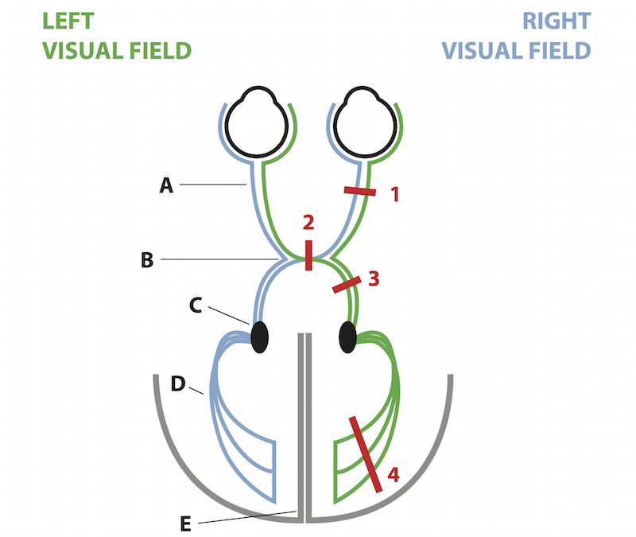
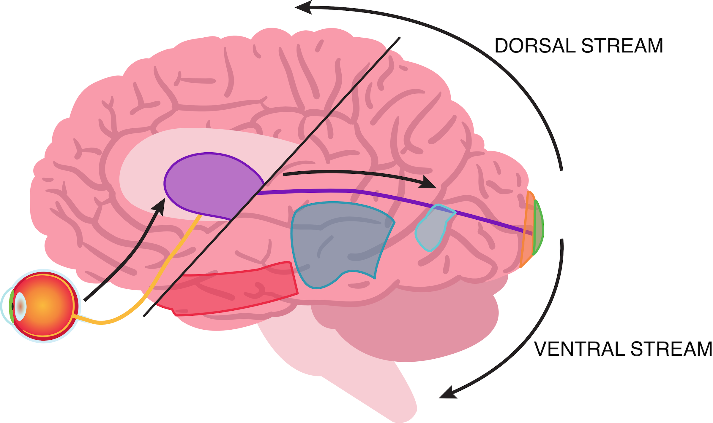

# 3-1 Vision

## The Properties of Vision

- The human visual system has both parallel and sequential processing.
- Sequential processing: 
  - retina -> optic nerve -> thalamus -> visual cortex
- Visual cortex processes in parallel shape, color, object identity, distance, motion, etc.
- Depth perception is made possible by simultaneously processing information from both eyes.

## The Nature of Light

- Light is electromagnetic radiation.
- **Wavelength** is a key characteristic of electromagnetic radiation.
  - Wavelength: gamma ray < X ray < ultraviolet < **visible** < infrared < microwave < radio
- Light speed: 300,000 km/s
  - The fast speed of light enables organisms to understand their environment quickly.
- **Photon**
  - Light as a particle.
  - Light has the properties of particles.
  - wave-particle duality.
  - One photon is the minimum unit of light.
- Recommended reading
  - [Wave–particle duality | Wikipedia](https://en.wikipedia.org/wiki/Wave%E2%80%93particle_duality)
  - [How Light Works](https://science.howstuffworks.com/light.htm)
  - [Wave-Particle Duality | LibreTexts](https://chem.libretexts.org/Bookshelves/Physical_and_Theoretical_Chemistry_Textbook_Maps/Supplemental_Modules_(Physical_and_Theoretical_Chemistry)/Quantum_Mechanics/09._The_Hydrogen_Atom/Atomic_Theory/Electrons_in_Atoms/Wave-Particle_Duality)
- The fastest signals in the human body are sent by myelinated axons responsible for touch and proprioception, traveling at speeds of around 100 meters per second (more than 200 miles per hour).
- Einstein’s photoelectric equation: E = hf

## The Eye

- **Key words**: cornea, lens, ciliary muscle, retina, photoreceptor, optic nerve, oculomotor muscle, pupil (aperture), fovea, bipolar cell (interneuron), retinal ganglion cell
- The human eye has as many as 100 million photo receptors.
- **Fovea**: The place in the retina where photoreceptors are tightly packed, which realizes high resolution vision.
a blind spot on the retina. Thus, photoreceptors are unevenly distributed across the retina.
- Most mammals do not have a high-resolution fovea.
- Focus: vertebrate brains
- The retina has at least 10 distinct layers.
- **Retinal ganglion cell**: a feature detector.
- **Horizontal and Amacrine cells**: Lateral integration of signals.
- Diversity of cells in the retina:
  - Photoreceptors: 2 (rods and cones) or 4 (rods and 3 types (RGB) of cones).
  - Interneurons: about 50.
  - Retinal ganglion cells: about 30.
- This diversity of retinal cells allow for detailed differentiation and integration of the visual input.
- Recommened reading
  - [Evolution of the eye | Wikipedia](https://en.wikipedia.org/wiki/Evolution_of_the_eye)

## Phototransduction

- **Key words**: rod, cone, dynamic range, rhodopsin, vitamin A, amplification
- Photoreceptors are biological pixels in the retina.
- Two main types of photoreceptors
  - **Rod**: To detect low light level.
  - **Cone**: To detect high light level and colors.
  - Due to this organization, humans can see colors in the bright but not in the dark.
- The retina does not represent absolute light intensity that falls onto it.
- **Dynamic range**
  - The eye has a dynamic range.
- Phototransduction: Conversion of energy of light in the photoreceptor
  - electromagnetic (photons) -> chemical -> electrical -> chemical
    1. Outer segment: photon -> chemical
    1. Inner segment: chemical -> electrical
    1. Synaptic terminal: electrical -> chemical
- #rods : #cones = 20 : 1
- Certain molecules can absorb photons at particular wavelengths. This causes the molecules to change shape.
- **Rhodopsin** (= retinal + opsin) is a membrane protein that is localized to the disks in the outer segment of the photo receptor. It's composed of a G protein-coupled receptor, opsin, and its ligand, retinal. Together, they form the visual pigment rhodopsin.
- **Vitamin A** is essential for phototransduction.
- Different activation on strong and weak light 
  - light -> closing ion channels -> hyperpolarizing photoreceptors
  - dark -> opening ion channels -> depolarizing photoreceptors -> releasing neurotransmitters
- **Amplification**: one rhodopsin -> 100's of G-proteins -> many phosphodiesterases -> degrading 1000's  of c-GMPs
  - One photon is actually sufficient to convert 11-cis retinal to all-trans retinal to initiate the phototransduction process.
- Photoreceptors contain g-protein coupled receptors, which is a type of metabotropic receptor. Metabotropic receptors indirectly change the internal state of the cell through second messengers. The advantage of this indirect system is the ability to amplify a small extracellular signal through an intracellular signaling cascade.

## The Dress

- Recommended readings
  - [Striking individual differences in color perception uncovered by ‘the dress’ photograph by Rosa Lafer-Sousa, Katherine L. Hermann, and Bevil R. Conway](https://www.cell.com/current-biology/fulltext/S0960-9822(15)00535-7)
  - [The many colors of 'the dress' by Karl R. Gegenfurtner, Marina Bloj, and Matteo Toscani](https://www.cell.com/current-biology/fulltext/S0960-9822(15)00494-7)
  - [Asymmetries in blue–yellow color perception and in the color of ‘the dress’ by Alissa D. Winke, Lothar Spillmann, John S. Werner, and Michael A. Webster](https://www.cell.com/current-biology/fulltext/S0960-9822(15)00542-4)

## Color Vision

- **Key words**: S/M/L cones, spectral selectivity, photopsin, dichoromat/trichromat/tetrachromat, metamer, photopic vision.
- Cone
- Bright light
- Finer details, rapid change
- 3 types of cones
  - **S cone**: Blue 420-440 nm
  - **M cone**: Green 535-505 nm
  - **L cone**: Red 565-580 nm
- **Spectral sensitivity**: The activation of each type of cones is seletive to the spectrum of light wavelength.
- The visual system can represent colors other than blue, green and red because their spectra are overlapped.
- **Photopsin**: GPCR protein cone receptors have (whereas rod receptors have rhodopsin).
  - Cone opsin
  - The color sensitivity stems from the fact that the photopsin protein differs by a few amino acids for each cone type, thus allowing light absorption at different wavelengths.
- **trichromat** or 3-color vision
  - dichromas: 2-color vision
  - tetrachromat: 4-color vision
- **Metamer**: different patterns that elicit the same percept.
- But in fish and birds (tetrachromat animals), for example, four pigments are used for vision. Because these animals have an extra cone with a different absorption spectrum, they're able to distinguish colors that would look the same to us.
- It's hard to perceive color at night.
- In bright light, cones are active and rods are inactive. Thus, color vision is dominant. This is also known as **photopic vision**.

## Retinal Processing

- **Key words**: receptive field, on-center cell, off-center cell.
- **Receptive field**: the region of visual space that when stimulated evokes a response in the cell.
  - **On-center cell**: light is ON at center and OFF at surrounding -> activation
  - **Off-center cell**: light is OFF at center and ON at surrounding -> activation
- The center-surround organization of the receptive field enhances sensitivity to edges and contrast.
- Retinal ganglion cells receive input from several bipolar cells.
- Among photoreceptors, interneurons and retinal ganglion cells, retinal ganglion cells are the only cell type in the retina capable of generating action potentials.

## The Retinal Circuit

- Direct pathway
- Lateral pathway
- Bipolar cell
  - Exication: Ionotropic glutamate-gated channels -> depolarizing EPSP
  - Inhibition: G-protein-coupled glutamate-gated channels -> hyperpolarizing EPSP
  - On bipolar cell: Light on -> Depolizing EPSP
  - Off bipolar cell: Light off -> Hyperpolarizing EPSP
- Some RGCs respond selectively to particular **colors** or **movement** of light patterns across local regions of the retina.
- Since there are currently over 30 specific types of amacrine cells and about one dozen types of bipolar cells known, this allows for a large combinatorial space to respond to specific features.
- Center-surround organization is not restricted to simple light vs dark. Depending on the type of horizontal or amacrine cells, receptive fields can include color or movement.
- Different connectivity patterns among amacrine and bipolar cells drive different response patterns (e.g., on center/off surround vs. off center/on surround).

## The Retinofugal Projection

- **Key words**: retinofugal projection, optic nervse, optic chiasm, optic tract, lateral geniculate nucleus (LGN), optic radiation.
- Retinotectal projection: the neural pathway from the retina of the eye to the superior colliculus in the midbrai.
- Tectum: a region in the midbrain that plays an important role in processing sensory information and controlling reflexes.
- Accessory optic system
- retina -> thalamus -> cortex
- **Retinofugal projection**
  - = the neural pathway that extends from the retina of the eye to the brain
  - The term "retinofugal" can be broken down into "retino-", referring to the retina, and "-fugal", indicating "fleeing from" or "moving away from".
- 5 major parts of retinofugal projection
  1. Optic nerve: This is the first part of the pathway, where axons from the retinal ganglion cells bundle together to form the optic nerve.
  1. Optic chiasm
  1. Optic tract: After the optic chiasm, the nerve fibers continue as the optic tracts. These tracts carry visual information to various parts of the brain, including the lateral geniculate nucleus (LGN) of the thalamus.
  1. Lateral geniculate nucleus (LGN)
  1. Optic radiations: From the LGN, the visual information is sent through the optic radiations to the primary visual cortex.
- **Optic chiasm**
  - Where the two pathways of the right visual field of the left eye and the left visual field of the right eye are crossed.
  - This cross is called a **decussation**.
- **LGN (lateral geniculate nucleus)** 
  - The LGN acts as a relay center and is critical for processing and sorting visual information before it is sent to the visual cortex.

## The Lateral Geniculate Nucleus (LGN)

- **Key words**: lateral geniculate nucleus (LGN), magnocellular/m-type neuron, parvocellular/p-type neuron, koniocellular neuron.
- The thalamus contains the LGN.
- The left LGN processes the right visual field, and the right LGN processes the left visual field.
- 3 main cell types in the LGN
  1. Magnocellular/m-type neuron
    - responds to **motion**.
  1. Parvocellular/p-type neuron
    - responds to **shape**.
  1. Koniocellular neuron (located betwen m- and p-type neurons)
    - responds to **color**.
- LGN <- retina
- LGN <-> visual cortex 
- These cells are innervated by axons from the retinal ganglion cells.
- The LGN neurons are projected to the primary visual cortex (V1).
- The retina is actually not the main source of synaptic input to the LGN.
- About 80% of excitatory synapses found in the LGN come back from the visual cortex. The function of this feedback pathway is poorly understood. This thalamocortical loop gives rise to rhythmic brainwave.
  - (The feedback may help the brain receive only changing part of images like video compression.)

## Primary Visual Cortex (V1)

- **Key words**: laminar structure, retinotopy, ocular dominance column (ODC).
- The cortical sheet itself has a **laminar structure**. That is, it is composed of layers. It is composed 6 layers in most parts of cortex.
- occipital lobe -> temporal and parietal cortices.
- Primary visual cortex = V1 = striate cortex
- **Retinotopy**: Axons from the LGN innervate cortex in an orderly fashion that preserves the spatial x,y organization of the retina in the spatial dimensions of the 2D cortical sheet. Spatial organization from the retina is preserved in V1.
- The primary visual cortex input arrives in very specific layers of the structure.
- The largest input occurs in layer 4, which includes information from the magnocellular and parvocellular neurons in the LGN.
  - In layer 4, the input driven by the left and right eyes remain segregated from each other in the **ocular dominance columns**, or **ODCs**. 
- ODCs span multiple cortical layers and are laid out in a striped pattern across the surface of V1.
- ODCs were very important in cortical plasticity.
- Monocular deprivation, for example patching one eye during development, causes specific columns to degrade while the non deprived eye assumed control over the cortical cells.
- Visual cortex is an exquisitely ordered structure with many different properties of the visual world mapped onto the physical structure of the cortex at different scales.

## The Physiology of Area V1

- **Key words**: microelectrode, center-surround organization
- **microelectrode**
  - a thin wire that can record the extracellular potential of a single neuron.
  - The extracellular potential is smaller than the intracellular one.
- The visual cortex has the **center-surround organization** as the retinal ganglion cells have.
- V1 serves as an edge detector that analyze local regions of space and determine the orientation of edges in those regions.
- While the inputs to layer 4 were monocular, binocular responses emerged in V1.
- **Ocular dominance**: Either the right or left signal has dominance in a certain cortical column.
- Ocular dominance columns, or ODCs, in V1 were found to be organized in patchy, stripe like structures.
- Hubel and Wiesel kicked off a revolution in our understanding of the functional properties of neurons and cortex.

## Visual Pathways

- **Key words**: vental visual pathway, dorsal visual pathway.
- The most basic visual features are detected at the back of the brain (occipital lobe) and each subsequent area anteriorly (forward) will extract more and more complex information.
- dorsal (up), ventral (down), anterior (front), posterior (back).
- V1 -> ventral and dorsal pathways
- **Vental visual pathway** (WHAT pathway)
  - V1 -> V2 -> V4 -> IT (Inferior Temporal) cortex
  - Size: larger receptie field -> ... -> larger receptie field
  - Complexity: edges -> lines -> curves -> shapes/faces (IT)
- **Dorsal visual pathway** (WHERE/HOW pathway)
  - V1 -> MT (middle tempora): activated by direction/velocity of motion 
  - V1 -> PPA (posterior parietal): to direct attention to particular visual space. Spatial attention.
- [Two-streams hypothesis | Wikipedia](https://en.wikipedia.org/wiki/Two-streams_hypothesis)

## Lesions of the Visual Cortex

- Lesion types
  - Experimental lesion (animal brain)
    - Permanent lesion
      - Suctioned out
      - Chemical damaged
    - Temporary lesion
      - Drug injection
      - Optogenetics
  - Observed lesion
    - Disease
    - Stroke
    - Injury
      - Concussiosn
      - Firearm
- Lesions in the visual cortex
  - V1 X: scotoma = blind spot [[video on scotomas](https://www.youtube.com/watch?v=5_m9dyaKc_s)]
  - IT X: (object, face) agnosia, prosopagnosia (= face agnosia)
  - MT X: akinetopsia (motion blindness; patients recognize the world as a set of disjoint image frames) [[youtube](https://www.youtube.com/watch?v=QV59aAtznSg)][[youtube](https://www.youtube.com/watch?v=gHA0QxGSqr4)]
    - (MT may consistently predict next motion and fill the gam between static temporal perception)
  - PPA X: unilateral -> visual neglect. bilateral -> Balint syndrom and Simultagnosia (inability to direct attention anywhere in the visual field and to experience the world as a whole)

## Review of Pathways and the Binding Problem

- **Binding problem**
  - "How items that are encoded by distinct brain circuits can be combined for perception, decision, and action?"
  - Information about what and how and where is scattered between the dorsal and ventral pathways, how do we get it all back together so we can interpret a scene?
  - This is a hard problem in neuroscience, and its answer is still unknown.
  - [Binding problem | Wikipedia](https://en.wikipedia.org/wiki/Binding_problem)

## Interactive Diagram: The Eye

- Cornea
- Aqueous Humor
- Iris
- Pupil
- Lens
- Vitreous Humor
- Retina
- Retinal Ganglion Cells
- Rods
- Cones
- Bipolar Cells

## Interactive Diagram: Visual Processing

- Eye
- Retina
- (A) Optic nerve
- (B) Optic chiasm
- (C) Lateral Geniculate Nucleus (LGN)
- (D) Optic tract
- (E) Primary Visual Cortex (V1)
- V2
- V4
- Inferior Temporal Cortex (IT)
- MT (middle tempora)
- PPA (posterior parietal)

## Anatomy of the Visual System

- This supplemental video provides a general anatomical overview of the visual system by Dr. Mohini Lutchman.

## The Poetry of Perception

- How do we perceive the world? This is a question that neuroscience has long sought to tackle, but which poets and artists have pursued even longer. In this section, we present an artistic rumination on vision, inspired by Emily Dickinson's poem, "We grow accustomed to the dark."

## Neuroscience of Color

- The brain has part that responds to a particular color of not only red, green and blue but also orange, yellow and pink.
- The brain can be activated by color contrast.

## Neuroscience of Art

- Everywhere in the brain, all of the cells that project long distances are excitatory.
- Inhibitory neurons are always local.
- local inhibition produces a number of effects in contrast.
- Central and peripheral vision
- "Vision is information processing, not image transmission."