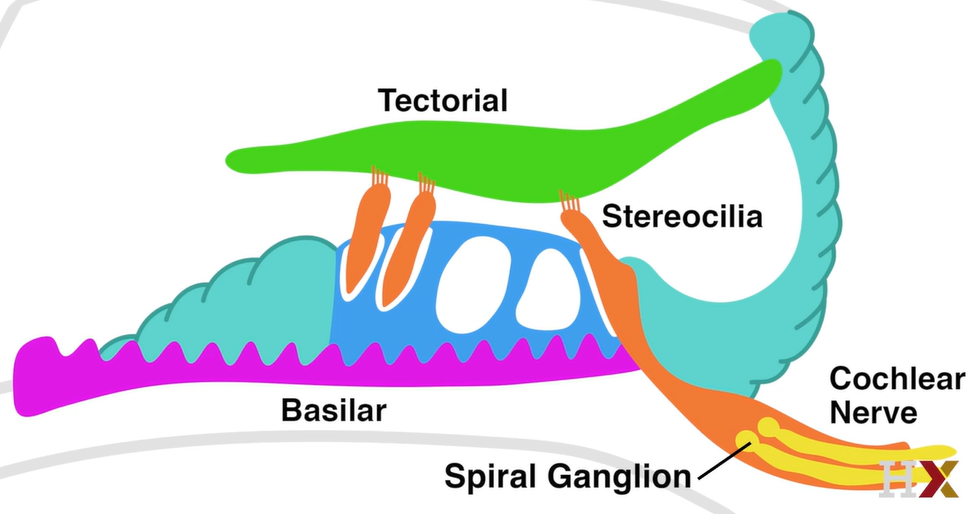
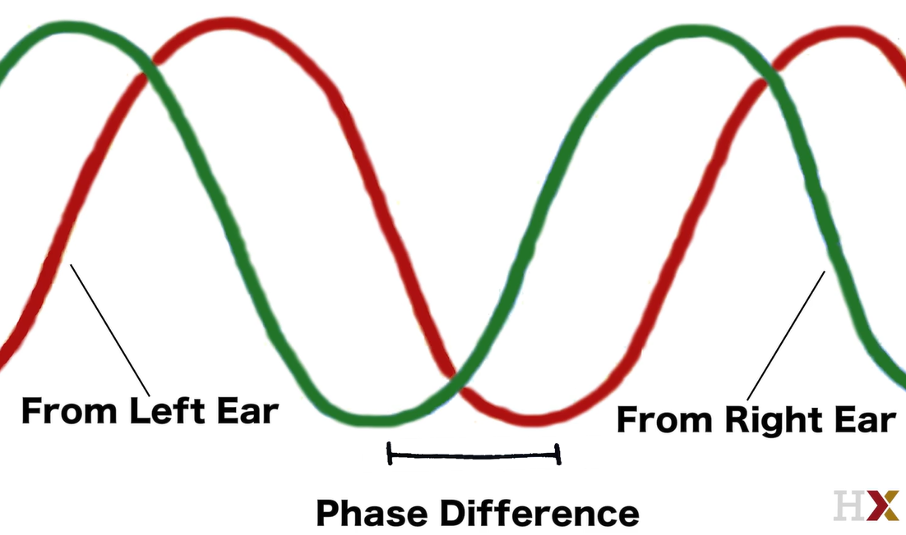

# 3-2 Audition

## Introduction to Lesson 2

- Benefit of audition
  - The ability to get information from all directions.
  - Source separation
- Music is found in every culture.

## Lesson 2 Highlights

- The nature of sound
- An overview of auditory anatomy
- How the brain processes sound, including subcortical auditory processing and what happens in the auditory cortex
- Two types of hearing loss: conduction deafness and sensorineural hearing loss
- An interactive diagram of the auditory system
- An animation inspired by Emily Dickinson's Poem, "Split the lark"
- Supplemental Materials
  - [UTHealth Online Neuroscience Textbook Chapter 12 Auditory System: Structure and Function](https://nba.uth.tmc.edu/neuroscience/s2/chapter12.html)
  - [UTHealth Online Neuroscience Textbook Chapter 13 Auditory System: Pathways and Reflexes](https://nba.uth.tmc.edu/neuroscience/s2/chapter13.html)

## The Nature of Sound

- Medium of sound: Air, water.
- Sound: Variation of pessure in the medium, namely, air.
- Rarefaction wave: A wave that travels by changing density pressure in medium.
- Speed of sound: 343 m/s
  - Fast but slower than light.
- Amplitude: loudness
- Frequency: pitch
  - Human hearing range: 20-20,000 Hz
  - Human speech: 200-2,000 Hz

## Auditory Anatomy

- Ear: outer ear -> middle ear -> inner ear
- Ear: pinna -> auditory canal -> tympanic membrane (eardrum) -> 3 ossicles (malleus/hammer, incus/anvil, stapes/stirrup) -> oval window -> cochlea (fluid) -> basilar membrane, hair cells
- Outer middle inner ear
- Pinna: To collect sound
  - Sensitivity: front, side > back
  - Many animals can move pinnae to collect sound from different directions.
  - Its shape helps to control sound.
- Ossicles
  - Amplifier.
- The middle ear is what allows us to reduce reflection because the middle ear is filled with mainly air and scarcely ossicles.
- **Impedance matching** in the middle ear
  - This counteracts loss due to reflection.
  - It turns up the volume. Amplicaiton is implemented by large eardrum -> small ossicles.
- **Gating** in the middle ear
  - It protects the inner ear from too loud sound.
  - Muscles in the middle ear can reduce the transmission efficiency of the ossicles.
  - These muscles are activated in two ways.
    - **Pre-programmed** gating
      - Before you speak, the muscles contract so that the sound of your own voice doesn't drowned out the sounds around you.
    - **Reflexive** gating
      - In response to a loud noise, either sudden or continuous, the muscles contract to reduce ossicle vibration.

## Conduction Deafness

- **Conduction deafness** is a hearing loss that happens because sounds cannot get through the outer and middle ear.
- Causes of conduction deafness
  - Sticking your finger in your ear
  - A ruptured eardrum
  - Otosclerosis (damage to middle ear bones, say, ossicles)
- Conductive deafness can be treated with external hearing aids.
  

## The Inner Ear

- [2-Minute Neuroscience: The Cochlea](https://www.youtube.com/watch?v=WeQluId1hnQ)
- **Vestibular system** is responsible for balance.
- **Cochlea**
  - is responsible for hearing.
  - transforms sound vibrations into neuronal activity.
  - consists of scala vestibuili (inner), scala media (middle), and scala tympani (outer).
  - has two membranes: Reissner's membrane and basilar membrane.
    - scala vestibuili (inner) - **Reissner's membrane** - scala media (middle) - **basilar membrane** - scala tympani (outer)
  - has tectorial membrane and organ of corti.
  - is filled with two fluids: the endolymph and the perilymph.
- The inner ear is directly responsible for transformation of sound vibrations to neuronal activity.


## Physiology of the Cochlea

- **Key words**: tympanic membrane, ossicles, perilymph, basilar membrane, tectorial membrane, hair cells, depolarization.
- **Membrane shearing**
  - is responsible for depolarization and hyperpolarization.
- Depolization process
   1. Sound waves vibrate bones.
   1. Bones vibrate fluids.
   1. Fluids cause membrane to fluctuate.
   1. Cells move.
   1. Ion channels open.
   1. Depolarization.
- A hair cell will depolarize or hyperpolarize based on how and in which direction the basilar membrane is displaced at any given moment.
- The hair cell is a cell with mechanosensitive channels that is anchored in the basilar membrane and translates a mechanical shearing force into an electrical signal.
- Normally about 10% of these ion channels are open at any given moment.
- When stereocilia are tilted towards the tall edge, more ion channels open and cause **depolarization** of the hair cell. 
- When they tilt away from the tall edge, more ion channels close and cause **hyperpolarization**.
- The base of **hair cells** are physically anchored in the basilar membrane, and the tops of hair cells (stereocilia) are physically anchored to the tectorial membrane. When these two membranes move relative to one another, it applies a shearing force to the hair cells in between. The movement of the **tectorial membrane** relative to the **basilar membrane** causes a shearing force that opens mechanically gated ion channels in the hair cells and depolarizes them.




## Frequency Detection

- Sound is a combination of 1-dimensional high and low frequencies.
- The **basilar membrane** of the cochlea can differentiate components of combined frequencies.
  - This is similar to the Fourier transform.
- **Place coding**: The **frequency/pitch** is encoded by which neurons in a certain place are active. These neurons are **tonotopically** mapped based on mechanical properties of the basilar membrane.
  - In the **taut base**, the basilar membrane is thin, reacting to high frequencies.
  - In the **loose apex**, the basilar membrane is thick, reacting to low frequencies.
  - It is easy to understand by associating guitar strings.
- The **amplitude/loundness** is encoded by the activity level of neurons.
  - Loud sound = More hair cells activate.
  - Soft sound = Less hair cells activate.


## Sensorineural Hearing Loss

- **Sensorineural hearing loss (SNHL)**: Sensorineural hearing loss (SNHL) is a type of hearing loss that occurs due to damage to the **inner ear (cochlea)** or to the nerve pathways from the inner ear to the brain. It is the most common type of permanent hearing loss. SNHL reduces the ability to hear faint sounds and even when sound is loud enough to hear, it can still be unclear or seem muffled.
- **Conduction deafness**: Conduction deafness, also known as conductive hearing loss, occurs when there is a problem conducting sound waves anywhere along the **pathway** through the **outer ear, tympanic membrane (eardrum), or middle ear (ossicles)**. This type of hearing loss is characterized by a reduction in the sound level or the ability to hear faint sounds. However, the quality of the sound may be preserved to some degree.
- **Cochlear implants**: A cochlear implant is an electronic medical device that replaces the function of the damaged inner ear.
- **Audiogram**: Audiograms are graphical representations of an individual's hearing sensitivity across a range of frequencies, typically from low (bass) to high (treble) sounds. They are used by audiologists to diagnose the type and degree of hearing loss. During a hearing test, sounds are played at various frequencies and decibels (dB), and the softest sounds the person can hear at each frequency are marked on the audiogram.
- A tonotopic mapping of the basilar membrane is what makes audiograms useful for determining where the damage occurred in sensorineural hearing loss.

## Subcortical Auditory Pathways

- **Subcortical auditory pathways**
  - Pathway 1: cochlea -> cochlear nucleus (CN) -> superior olive -> inferior colliculus (in midbrain) -> superior colliculus -> medial geniculate nucleus (MGN) (in thalamus)
  - Pathway 2: cochlea -> cochlear nucleus (CN) -> inferior colliculus (in midbrain) -> superior colliculus -> medial geniculate nucleus (MGN) (in thalamus)
- The **cochlear nucleus (CN)** has a tonopic map aligned with the cochlea frequency map.
  - **Tonotopy**: Spatial organization of neural responses to sound according to frequency.
- **Superior olive** 
  - integrates auditory signals from both ears.
  - localizes sounds.
  - determines the direction and distrance of sounds.
  - is involved in auditroy reflexes.
- **Inferior colliculus** (in midbrain)
  - integrates auditory signals from both ears.
  - localizes sounds.
  - determines the direction and distrance of sounds.
  - contributes to 3D auditory perception.
- **Superior colliculus**
  - directs and orients head and eye movements in response to visual stimuli.
- **Medial geniculate nucleus (MGN)** (in thalamus)
  - MGN plays a role in allowing us to direct and maintain our attention to a particular sound.


## Auditory Cortex

- The auditory cortex processes the complex content of a sound.
- The auditory cortex is also likely where the sound is perceived consciously.
- The primary auditory cortex is located bilaterally in the temporal lobes, roughly near Brodmann areas 41 and 42.
- Brodmann areas
  - Brodmann areas are regions defined by their cytoarchitecture -- basically how they look under a microscope stained by different chemicals.
  - They don't strictly correspond to functional divisions of the brain.
  - They comprise a useful reference frame.
  - Scientists still use their areal nomenclature extensively.
- Auditory cortex processes frequency, time, intensity, sound type and localization as well as specially phonemes.
- Both ears send inputs to both sides of the auditory cortex.
  - The auditory cortex is more resilient to lesions than the visual cortex
- The auditory information flow: Pinna, tympanic membrane, ossicles, cochlea, hair cells, CN, superior olive, inferior colliculus, MGN, A1.


## Localizing Sound

- Localizing a sound = Finding the location of the sound
- Having two ears help localize sounds.
- **Interaural time difference (ITD)**
  - A sound coming from one side of our head will reach the near ear about a half millisecond faster than the other ear.
  - The endbulb of held helps quickly compute the phase difference from the two ears.
- **Interaural level difference (ILD)**
  - A sound coming from one side of our head will reach the near ear louder than the other ear.
  - This 
- **Endbulb of held**
  - Lots of neurotransmitter released
  - Many receptors to receive the signal
  - Allows rapid signal transmission
- Basic computation to localize sounds is to learn the correlation of the differences and actual location.
- Further reading
  - ["How the Barn Owl Computes Auditory Space" by Benedikt Grothe 2018 (review)](https://www.cell.com/trends/neurosciences/pdf/S0166-2236(18)30017-1.pdf)
  - [“Mechanisms of sound localization in the barn owl (Tyto alba)” by Knudsen and Konishi, 1979](https://link.springer.com/article/10.1007/BF00663106)





## Interactive Diagram: Audition


## Anatomy of the Auditory System

- This supplemental video provides a general anatomical overview of the auditory system by Dr. Mohini Lutchman.

## The Poetry of Perception

- How do we perceive the world? This is a question that neuroscience has long sought to tackle, but which poets and artists have pursued even longer. In this section, we present two artistic ruminations on audition, inspired by Emily Dickinson's poem "Split the lark" and an excerpt from Walt Whitman's "Song of Myself."

## Split the lark

- A poem by Emily Dickinson

**Split the Lark - and you'll find the Music**

```
Split the Lark — and you'll find the Music —
Bulb after Bulb, in Silver rolled —
Scantilly dealt to the Summer Morning
Saved for your Ear when Lutes be old.

Loose the Flood — you shall find it patent —
Gush after Gush, reserved for you —
Scarlet Experiment! Sceptic Thomas!
Now, do you doubt that your Bird was true?
```

## Song of myself

- A video about one's self and sensation