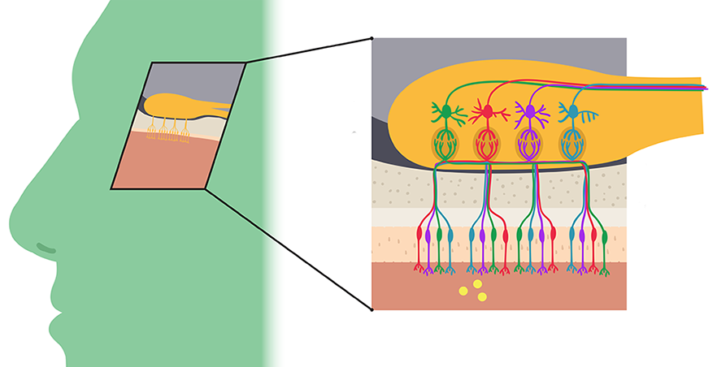

# 3-3 Smell, Taste, and the Remaining Senses

## Introduction to Lesson 3

- There are more than five senses in the animal kingdom.
  - Humans' five senses: sight (vision), hearing (audition), taste (gustation), smell (olfaction), touch (tactile perception).
  - Eels' electroception
  - Vampire bats' infrared sensation
  - Birds' magnetoseption
  - Bats' ultrasound perception

## Lesson 3 Highlights

- Lesson 3 Highlights
  - Gustation
  - Olfaction
  - Somatosensation
  - Super senses!
  - Animations inspired by Walt Whitman's "Song of Myself," Emily Dickinson's "I taste a liquor never brewed," and William Carlos Williams' "Smell!"
- Supplemental Materials
  - [UTHealth Online Neuroscience Textbook Chapter 4: Somatosensory Pathways](https://nba.uth.tmc.edu/neuroscience/s2/chapter04.html)
  - [UTHealth Online Neuroscience Textbook Chapter 5: Somatosensory Processes](https://nba.uth.tmc.edu/neuroscience/s2/chapter05.html)
  - [UTHealth Online Neuroscience Textbook Chapter 9: Chemical Senses](https://nba.uth.tmc.edu/neuroscience/s2/chapter09.html)

## Gustation: Receptors

- **Taste** includes chemical perception, smell, texture, temperature, level of pain
- **Gustation**
  - Gustation, or the sense of taste, is one of the fundamental senses that enables the perception of flavor from substances on the tongue and other parts of the mouth.
  - It is a chemical sense, wherein taste receptor cells in taste buds detect molecules and ions dissolved in saliva. 
  - These receptors are primarily located on the tongue but are also found in other areas of the mouth and throat.
- 5 basic tastes
  1. **Sweet**: Often associated with **energy-rich** foods, sweetness is typically caused by the presence of **sugars**.
  1. **Sour**: The taste of **acidity**, indicative of potentially spoiled or fermented substances.
  1. **Salty**: Usually indicates the presence of **sodium ions**, essential for physiological processes.
  1. **Bitter**: Often associated with potentially **poisonous** substances, bitterness serves as a natural warning system.
  1. **Umami**: A savory taste, indicating the presence of **glutamate**, and often associated with **protein-rich** foods.
- Taste buds have taste receptors.
- Taste receptor cells for each taste are distributed uniformly across the tongue.
- Sour and salty tastes are both mediated by ion channels.
- Sweet, umami and bitter are mediated by **GPCRs (G protein-coupled receptors)**.
- Types of GPCRs
  - **T1R** receptors: sweet and umanmi
  - **T2R** receptors: bitter

## Gustation: Perception

- It's the cell, not the chemical receptor, which carries all of the neurobiological meaning.
  - Receptors become selective to a certain chemical.
  - Receptors activate their cell.
  - Cells cause the sense of a certain taste.
  - These principles have been proven by transgenic mice.

## Interactive Diagram: Gustation

- This session shows figures about tongues in relation to tastes and receptors.

## Olfaction: Receptors

- Olfaction: The sense of smell
- **Odor**: Percept of a given smell, namely, a mixture of odorants
- **Odorant**: A substance giving off a smell
  - Odorants are generally small and hydrophobic.
    - Hydrophobic: not mixed with water
- **Volite**: A substance easily evaporated at normal temperatures
- Human genome is rich with genes that encode for about 1,000 olfactory receptors. Each gene appears to code for a single type of olfactory receptor.
- **Pseudogene**: Pseudogenes are genomic DNA sequences highly similar to normal genes, but they're not translated into functional proteins.
  - In dogs and mice, only about 20% of the 1,000 genes are considered to be pseudogenes.
  - In humans, about 60% to 70% of the 1,000 genes are considered to be pseudogenes.
  - Each human appears to have a different number of pseudogenes, thus resulting in individual differences in sensitivity to specific smells.
- **Shape pattern theory**
  - Scent perception depends on the amount of structural fit between an odorant receptor's shape and the odorant's shape, much like a puzzle.
  - An odorant can have different smells depending on which parts of its **chemical structure bind to a given odorant receptor**.
  - Example: Steroisomers, d-carvone and l-carvone, have the same atoms but different structures, resulting in different smells.
- Smell changes based on **odorant concentration**.
- The activated **order of ordants** affects the perceived smell.
- These are why we perceive more scents than odorant receptors.
- The olfactory system has evolved mechanisms for disentangling odors.

## Olfactory Pathways

- Functions of the nose: to filter, warm and humidify air.
- Olfactory epithelium can be considered the retina of the nose. It consists of three primary cell types: 
  1. Supporting cell: It provides metabolic and physical support for olfactory sensory neurons.
  1. Basal cell: It is a precursor cell to the olfactory sensory neuron and provides renewable neurons in a stem cell-like state.
  1. Olfactory sensory neuron (OSN): It is a bipolar neuron located beneath a watery mucus layer.
- Olfactory sensory neuron responses are orders of magnitude slower than the visual or auditory systems.
- Peak currents are often not reached until one to two seconds after the odorant reaches the receptors. And it takes many seconds to reset the cell back to baseline.
- The olfactory nerve is one of the central nervous systems nerves capable of **regeneration**, making a useful model for neuronal regeneration studies.
- The two olfactory bulbs are a blueberry-sized extension of our brain just above the nose level which serves as the first critical relay station where olfactory information is processed.
- **Anosmia**: Anosmia is the loss of the sense of smell.
  - Anosmia often also causes profound loss of taste in addition to the loss of smell.
- Olfactory information is passed onto the primary olfactory cortex where incoming olfactory information is first processed.
- Olfactory information also travels to the amygdala hippocampal complex, as well as the entorhinal cortex in the medial temporal lobe. These areas are part of the limbic system. 
- The **limbic system** is involved in many aspects of emotion, memory, behavior and motivation. Unlike the other sensory systems, olfaction is quite unique in that it directly innervates the limbic system. This direct connection might help explain why certain scents tend to have very strong emotional associations.
- Attaching a verbal label to a smell is often not so easy. Anthropologists have found that there are fewer words to describe the human experience of smell compared to other sensations.
  - The majority of all olfactory processing is thought to occur in the right side of the brain, while most language processing occurs in the left side of the brain.

## Interactive Diagram: Olfaction

## Somatosensory Receptors

- **Somatosensation**: The sense of touch (pressure, stretch, vibration, temperature), body movement, and pain.
- **Somatosensory receptors**: thermoreceptors, photoreceptors, mechanoreceptors, chemoreceptors.
  - **Propioception**: sensing body movement 
  - **Mechanoception**: sensing touch
  - **Thermoception**: sensing temperature
  - **Nociception**: sensing pain
- **Cutaneous sensation**: the ability of the skin to perceive different types of stimuli.
- **4 cutaneous sensations**
  - Touch: Mechanoception
  - Pressure: Mechanoception
  - Heat/Cold: TRP channels
  - Pain: TRP channels
- **Nociceptor**: The nociceptor is a sensory receptor for painful stimuli.
- **Transient receptor potential (TRP) channels**
  - TRP channels are a group of ion channels that mediate sensations, including pressure, volume, stretch, vibration, and even certain tastes.
  - Some hot sensitive TRP channels are activated by molecules found in spices like garlic, chili pepper, or wasabi.
  - Others are activated by substances like menthol, camphor, or peppermint, thus mediating a cooling sensation.
  - Most TRP channels are non-selectively permeable to cations, including sodium, calcium, and magnesium, and thus can depolarize and activate a sensory neuron when stimulated.
- Since nociceptive neurons generate trains of action potentials in response to intense stimuli, their firing frequency
determines the intensity of the pain.
- The type of somatosensory receptor sensing a touch differs depending on whether or not it is perceived via hairy or hairless (glabrous) skin.

## Somatosensory Processing

- Somatosensory cortex is located in the parietal lobe.
- The primary, or first, neuron always has its soma in the dorsal root ganglion of the spinal nerve.
- The secondary neuron has its soma either in the spinal cord or in the brain stem.
- In the case of touch, and certain types of pain, the tertiary, or third, neuron has its cell body in the thalamus and ends in the postcentral gyrus of the parietal lobe, where the primary somatosensory cortex, or S1 resides.
- **Dorsal root ganglion (DRG)**:= a cluster of nerve cell bodies (neurons) located within the dorsal root of each spinal nerve.
- In the periphery, **slow, thin, and unmyelinated neurons** conduct **pain**.
- In the periphery, **faster, thicker, and myelinated neurons** conduct casual **touch**.
- The two dimensional organization of the skin forms a **somatotopic map** in the primary somatosensory cortex (S1).

## Interactive Diagram: Somatosensation

- Hair
- Epidermis
- Dermis
- Hypodermis
- Free Nerve Endings
- Merkel’s Disc
- Meissner’s Corpuscle
- Hair Follicle Receptor
- Pacinian Corpuscle
- Ruffini’s Ending

## Sensation in the Animal Kingdom

- Some animal species have developed extraordinary sensory systems to perceive and adapt to their environment.
- The visual system of the buzzard
  - Its retina has over a million photo receptors per square millimeter, which allows this aerial hunter to see small rodents from a height of up to 15,000 feet, or 4 and 1/2 kilometers.
- The visual system of a deep sea fish
  - With up to 25 million rods per square millimeter in their retina, select deep sea fish appear to have highly adaptive visual systems to detect dim bio luminescent flares in the deep sea.
- The visual system of the box jellyfish and spiders
  - With many eyes, they can receive light easily.
- The skin of the starfish
  - It detects light from the skin.

## Super Senses

- Mechanosensation: touch, hearing, balance, pain, environmental change.
- **Magnetosensation**: Certain migratory birds, for example, are believed to use magnetic cues in addition to several other factors to find their way across the globe during migration season.
  - It is not yet known by which biophysical mechanism and by which receptors magnetosensation is actually achieved.
- **Thermoception**
  - Bats, for instance, can detect the warmth of the animal from about a half a foot away using their nose leaf.
  - The prize for thermoception goes to snakes, however. **Pit vipers**, for instance, have a heat sensitive organ between their eyes and nostrils, which allows them to respond to temperature changes as small as 0.002 degrees Celsius. This is especially useful for hunting and allows these predators to find their prey even if it's hiding out of sight.
- **Electroception**
  - Having been observed most almost exclusively in amphibious or aquatic animals eince water is a much better conductor of electricity than air, electroception is used for both **detecting objects** and for **communication**.
  - Most passive electroreceptors can detect thresholds on the order of nanovolts per cubic centimeter. This ability makes them effective hunters, because prey create electric fields when they move their muscles and when their hearts beat.
  - Some species actively generate electricity, including various species of electric fish like the electric eel. And they can detect objects in their environment by perceiving how the electric field they produce around themselves is modified by the presence of other objects.
  - Many fish also use their active electroreceptive sense to communicate as part of their social behavior. So this fish can use their electric scents to detect their sexual counterparts.

## Anatomy of the Olfactory System

- This video provides a general anatomical overview of the olfactory system by Dr. Mohini Lutchman.

## The Gustatory System

- Gustatory information does not cross over.

## Poetry of Perception

- Skipped.

## Song of Myself

- Skipped.

## I taste a liquor never brewed

- Skipped.

## Smell!

- Skipped.