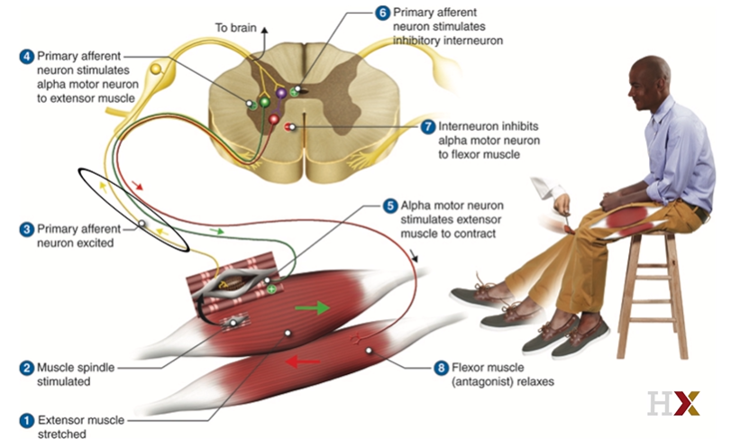
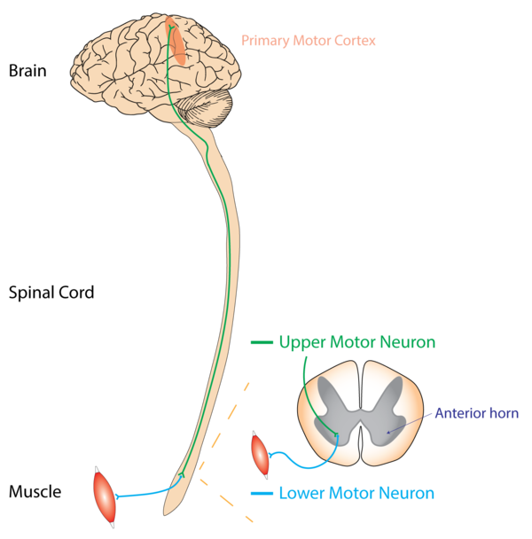
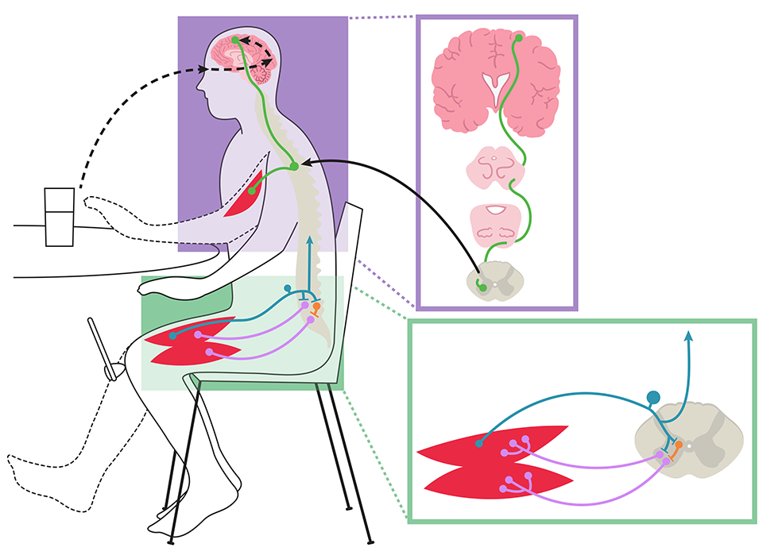

# 3-4 Movement and Action

## Lesson 4 Highlights

- Lesson 4 Highlights
  - Muscles
  - Lower motor neurons and upper motor neurons
  - Reflexes
  - How damage to the brain affects movement and action
  - Interactive diagram of voluntary and reflex movements
  - An animation inspired by Walt Whitman's poem, "Song of Myself"
- Supplemental Materials
  - [UTHealth Online Neuroscience Textbook: Section 3 Motor Systems](https://nba.uth.tmc.edu/neuroscience/s3/index.htm)

## Muscles

- The purpose of the motor system is to move the body.
- **Voluntary action**: a voluntary, conscious movement
- **Reflex**: an involuntary, unconscious movement
- Even a seemingly simple motor task like standing requires a large collection of different muscles because it allows us to perform actions in a variety of different scenarios.

## Skeletal Muscles

- (This session is difficult.)
- Key questions:
  - What are the three main types of muscle? What is the function of each?
  - What is the functional unit of the myocyte (muscle cell)? What kinds of filaments does it contain?
  - Define these terms: myocyte, myofilament, myosin, actin
- Three main types of muscle
  1. **Cardiac muscle**
    - produces involuntary movement.
    - is found **only in the heart**.
  1. **Smooth muscle**
    - produces involuntary movement.
    - is found in various parts of the body.     
  1. **Skeletal muscle**
    - produces voluntary movement.
    - is primarily attached to bones.
    - Tendons connect muscles to bones.
- All behavior fundamentally occurs through the musculature.
- Organization: Muscle -> Myocytes -> Contractile units (sarcomere) -> Myofibrils -> Myofilaments -> Structural proteins (actin, myosin)
- Functional unit of the myocyte (muscle cell)
  - See the organization of the muscle above.
- Composition of **filaments**
  - Actins + Myosins
- **Myocyte**
  - Muscle fiber
  - A basic building block of muscles
  - has multiple nuclei per cell.
- **Myofilament**
  - consists of thin filaments, actins, and thick filaments, myosins. 
- **Actin**
  - Thin filament
  - Every actin molecule has a myosin binding site, where the myosin molecules from thick filaments combined: binding destination of myosins.
- **Myosin**
  - Thick filament
  - binds to actins.
  - grabs onto and pulls itself along the actin filaments.
- **Sarcomere**
  - A buiding unit containing actins and myosins.
- *Skeletal muscle groups**
  1. **Axial muscles**: controlling the center or trunck of our body.
  1. **Proximal muscles**: controlling the chest, tigh, upper arms, etc.
  1. **Distal muscles**: controlling the forearms, calves, hands, feet, etc.

## Lower Motor Neurons

- **Upper motor neuron (UMN)**
  - Upper motor neurons (UMNs), are nerve cells in the central nervous system (CNS) that *initiate* and control voluntary movements.
  - These neurons originate in the motor regions of the cerebral cortex or the brainstem and convey motor commands down to lower motor neurons (LMNs).
- **Lower/alpha motor neuron (LMN)**
  - Lower motor neurons (LMNs) are the *final link* in the chain of neural pathways that carry motor commands from the brain to the muscles.
  - Lower motor neurons form the final common pathway for all behavior, causing the muscle contractions that generate force.
  - LMNs are controlled by the combination of 3 main sources:
    1. Dorsal root ganglion cells: signals from sensory systems.
    1. Excitatory and inhibitory spinal interneurons: signals within spinal cords.
    1. Upper motor neurons: signals from the brainstem and motor cortex.
- **Motor unit**:= (1 motor neuron) + (the set of muscle fibers the motor neuron controls)
- **1 muscle** = (muscle fibers from different motor units)
  - 1 muscle, for example, biceps and triceps. 
- The **size of a motor unit** determine its function.
  - **Small motor units**, controlling fewer muscle fibers, are involved in fine, precise movements.
  - **Large motor units**, controlling many muscle fibers, are used for gross, powerful movements.
- The amount of force generated by a single motor unit is most determined by the number of muscle fibers innervated by the motor neuron.
- Different size motor units are recruited in order from smallest to largest under Henneman's size principle.
- **Henneman's size principle**: The principle allows you to increase the amount of muscle contraction until you are exerting just enough force for a given action, but not overdoing it.
- **Graded control**:= the ability of the nervous system to regulate the strength, speed, and coordination of muscle contractions and other responses in a smooth and proportional manner.
- Depending on the location of motor neurons in the spinal cord, the controlled body part differentiates.

## Intrinsic Spinal Circuits

- The spinal cord contains special circuitry that can rapidly coordinate an action - a reflex - without the relatively slow input from the brain.
- Features of reflexes: short, automatic, involuntary.
- Dorsal root ganglion
- Upper motor neurons
- Myotatic/Muscle Stretch Reflex
  - It helps maintain muscle tone and posture.
  - It is an automatic, monosynaptic reflex that helps protect muscles from overstretching and injury, and plays a critical role in stabilizing joints.
  - During the myotatic stretch reflex, a stretch in the muscle is detected by muscle spindles (proprioceptors) which in turn causes the muscle to contract. This results in the muscle length staying the same. 
  - Most of that time, about 0.5 to 0.9 milliseconds, is taken up by the single synaptic delay.
- **Proprioceptors** sense changes in muscles.
- One of the advantages of having intrinsic reflexes like the myotatic stretch reflex is that our muscles don't need to wait for the brain to send commands to respond quickly to an incoming stimulus.
- In fact, descending input from the cortex has the ability to "override" reflexive circuits. For example, if you want to stretch a muscle voluntarily, cortical input would suppress the stretch reflex, allowing you to lengthen or contract your muscles without triggering a reflex.

## Central Pattern Generators

- Recurrence exists in neural networks.
- Central pattern generators (CPGs) are neuronal networks that can produce rhythmic patterned outputs even in the absence of ongoing sensory input.
- Rhythmic action: walking, swimming, bicyling.
- External modulators can make CPGs faster, slower, start or stop. External sensory cues can modulate the activity of central pattern generators.
- The headless chicken, Mike, could rhythimic behavior such as walking because of CPGs. 
- The basic neuronal circuitry for rhythmic motor movement is not something we need to learn. We appear to be born with it.
- Anencephalic babies who are born without a cerebral cortex do not typically live long, but they demonstrate a number of reflexive motor behaviors, such as grasping an object, if it's placed in their hand.
- The central pattern generators that control walking located in the spinal cord.

## Brain Control of Movement

- The role of the cerebral cortex play in generating movement
  - Fine motor control
- The role of the brainstem in generating movement
  - Postures such as sitting or standing upright
- **Upper Motor Neurons (UMNs)**
  - Location: UMNs have their cell bodies in the motor region of the cerebral cortex or in the brainstem. Their axons travel down the spinal cord within descending pathways.
  - Function: UMNs are primarily responsible for initiating and controlling voluntary movements, especially the fine motor movements. They modulate the activity of lower motor neurons through direct or indirect pathways.
  - Symptoms of Damage: Damage to UMNs can lead to spastic paralysis, increased muscle tone (hypertonia), hyperreflexia (exaggerated reflexes), and the presence of pathological reflexes (e.g., Babinski sign).
  - Pathways: Common UMN pathways include the corticospinal tract (for limb and trunk movements) and the corticobulbar tract (for face, head, and neck movements).
- **Lower Motor Neurons (LMNs)**
  - Location: LMNs are located in the anterior horn of the spinal cord's gray matter and in the cranial nerve nuclei of the brainstem. Their axons exit the central nervous system to innervate skeletal muscles directly.
  - Function: LMNs are the final common pathway for motor commands from the brain to the muscles. They directly innervate muscle fibers, causing them to contract and produce movement.
  - Symptoms of Damage: Damage to LMNs can lead to flaccid paralysis, decreased muscle tone (hypotonia), muscle atrophy, fasciculations (muscle twitching), and decreased or absent reflexes.
  - Types of Neurons: Includes alpha motor neurons (which directly trigger muscle contraction) and gamma motor neurons (which regulate the sensitivity of muscle spindle fibers, thus contributing to muscle tone).
- The information flow from the cerebral cortex to skeletal muscles
  - cerebal cortex -> brainstem -> spinal cord circuit -> skeletal muscle
- **Dorsolateral path**
  - The dorsolateral (back-side) path is controlled by cerebral cortex and midbrain.
  - The dorsolateral path controls distal muscles.
  - The dorsolateral path facilitates **fine motor control** through activation of small, specific groups of muscles in the extremities, allowing for example the movement of individual fingers.
  - In the mildest cases of dorsolateral lesion, voluntary movements just become slower and less accurate.
- **Ventromedial path**
  - The ventromedial (front-middle) path is controlled by nuclei in the brainstem.
  - The ventromedial path controls the **autonomic** nervous system and **posture** (sitting or standing upright).
  - This pathway innervates axial, or midline, lower motor neurons and interneurons which in turn synapse onto midline muscles.
- Damage to one pathway can often be compensated by a surviving path.

## Upper Motor Neurons

- The Penfield map is constructed by electrically stimulating brain regions.
- Primary motor cortex = M1 = Brodmann area 4.
  - Stimulating M1 causes specific muscle movement.
  - Neurons in M1 appear to initiate voluntary movements.
- Premotor cortex
  - It is located in front of the motor cortex.
  - Stimulating premotor cortex causes multi-muscle movement, such as the rotation of an entire limb.
  - It initiates higher level motor behavior.
- Posterior parietal cortex = homunculus
  - It is essential in planning movements, taking into account the location of the body in space, as well as location of various other objects with which the body might need to interact.
- The somatotopic map of M1
  - Like in visual and auditory cortices, the neurons of M1 are organized in a somatotopic map, with specific regions responsible for innervating specific body parts.
  - Face, lips, tongue and hands are over respresented in M1, meaning that those need to be able to generate complex behaviors.
- [2-Minute Neuroscience: Motor Neurons](https://youtu.be/WKBREYS9C9g?si=plxm0H2wkxYv6Skx)
- [2-Minute Neuroscience: Motor Cortex](https://youtu.be/APuiZCxDnTA?si=-wENy3tacEoizMRM)

## Corticospinal Neurons

- Distal motor task: e.g., hand manipulation.
- Distal motor task
  - Finding 1: Different motor neurons fire when felxing vs. extending
    - Implication: Upper motor neurons are sensitive to direction of movement.
  - Finding 2: There is a delay between activity in the motor cortex and activity in the wrist.
    - Implication: Motor cortex is activated before muscles, not in response to them.
  - Finding 3: The more force is required, the more intense corticospinal activity is.
    - Implication: Upper motor neurons can tune their firing to the amount of force needed.
  - Finding 4: Specific actions produce reliable patterns of activity.
    - M1 neurons do not habituate or adapt to frequent input activity.
- Upper motor neurons convey a lot of complex and coordinated information.
  - Direction
  - Force
  - Amplitude
  - Sequence, reprsented as a pattern of M1 activation
- Upper motor neurons are responsible for giving precise, fine motor commands to particular movements of particular limbs.

## Motor Control Heirarchy

- **Smooth, coordinated activity** and its **appropriateness** to a given task, may be the result of **modulatory inputs** from other areas of the brain which don't directly generate motor activity.
- **Basal ganglia** and **cerebellum** send modulatory signals.
- M1, the ventromedial and dorsolateral pathways send input to motor cortex.

## Lesions of Motor Cortex

- Key words: contralateral brain, leison compensation.
- Contralateral brain
  - The contralateral organization of the forebrain (Latin: contra‚ against; latus‚ side; lateral‚ sided) is the property that the hemispheres of the **cerebrum** and the **thalamus** represent mainly the contralateral side of the body.
  - Opposite: ipsilateral (left-left; right-right)
  - The cerebellum is ipsilateral, not contralateral.
- Much of the homunculus is devoted to the wrist and hand. Lesions to M1 often compromise independent skilled movements of the fingers or thumb.
- If a small group of neurons is damaged in M1, surviving pathways can often compensate for the lost functions of the damaged projections.
- If a large group of neurons is damaged in M1, the damage causes widespread impairment in voluntary movement.
- Understanding how cortical and subcortical motor pathways work together to produce behavior is very much an open area of research.
- Possible impairments of the motor cortex
  - Paresis: General weakness of movement.
  - Hypertonia: Increased tension in the muscles even at rest.
  - Hyperreflexia: Exaggerated reflex responsivity.

## Interactive Diagram: Movement & Action

- Signals transmitted from the corticospinal and corticonuclear systems can be modified by outputs that reach the cortex from the cerebellum, basal nuclei, and thalamus.
- The cerebellum is composed of a highly convoluted cerebellar cortex and a core of white matter containing the cerebellar nuclei.
- The cerebellum receives input from many areas of the brain and spinal cord and influences motor performance.

## Poetry of Perception

- Skipped.