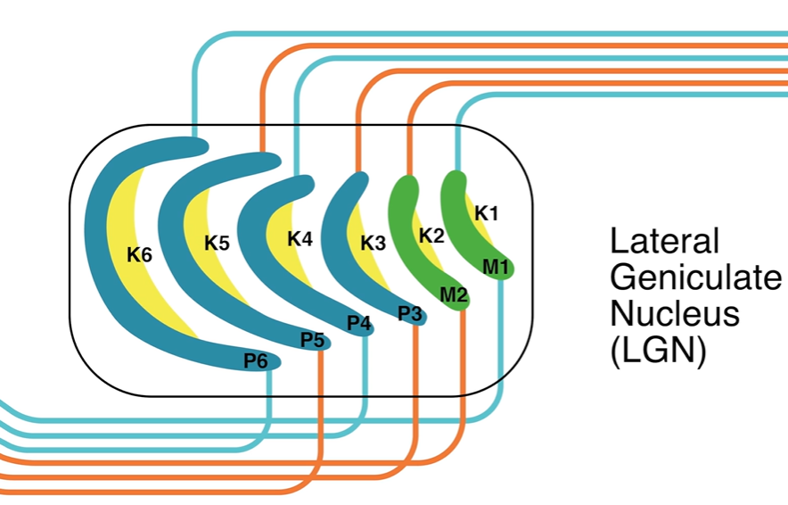

# 3-5 Subcortical Brain Areas

## Introduction to Lesson 5

- At an anatomic level, however, many neuroscientists agree that a big part of what's different about humans is our highly developed cerebral cortex.

## Lesson 5 Highlights

- Lesson 5 Highlights
  - Hindbrain
  - Midbrain
  - Cerebellum
  - Forebrain
  - Basal Ganglia
  - Thalamus
  - Limbic system
  - Hippocampus
  - Hypothalamus
  - Interactive diagram of subcortical brain structures
- Supplemental Materials
  - [UTHealth Online Neuroscience Textbook (motor systems): Chapter 4 Basal Ganglia](https://nba.uth.tmc.edu/neuroscience/s3/chapter04.html)
  - [UTHealth Online Neuroscience Textbook (motor systems): Chapter 5 Cerebellum](https://nba.uth.tmc.edu/neuroscience/s3/chapter05.html)
  - [UTHealth Online Neuroscience Textbook (homeostasis and higher brain function): Chapter 5 Limbic System Hippocampus](https://nba.uth.tmc.edu/neuroscience/s4/chapter05.html)
  - [UTHealth Online Neuroscience Textbook (homeostasis and higher brain function): Chapter 6 Limbic System Amygdala](https://nba.uth.tmc.edu/neuroscience/s4/chapter06.html)

## The Hindbrain

- **Hindbrain** (= rhombencephalon)
  - is responsible for autonomic functions like breathing/respiration, swallowing, coughing, and heart rate.
  - can do these with very little or no input.
  - consists of the brainstem (medulla, pons, and midbrain) and the cerebellum.
- The cerebellum appeared 400M years ago, which is newer than the brainstem.
- **Medulla** 
  - connects the higher levels of the brain to the spinal cord.
  - maintains posture and basic protective motor reflexes (vomiting coughing, sneezing, swallowing).
  - regulates breathing, heart rate, blood pressure, and digestion.
  - operates these unconsciously.
  - will take over, entirely overriding cortical signalsthe moment the medulla feels that you have slowed or sped respiration too extensively.
- **Pons**
  - means a bridge in Latin.
  - is a bridge between the midbrain and medulla.
  - is a key relay station, bridging the gap between the medulla, cortex, and the cerebellum.
  - includes the pontine nuclei that regulates sleep, respiration, swallowing, chewing, bladder control, eye movements, facial expressions, and upright posture. 
- It is often difficult to disentangle which functions are related to the pons, and which to the medulla. This is largely because a common set of interconnected nuclei, called the reticular formation.
- **Reticular formation**
  - runs throughout the three brainstem structures, critically linking their functions.
- You can think of the brainstem structures as a single regulatory system.
- These structures are so vital that it is not simple to find disorders of the brainstem, since most brainstem injuries or impairment result in instant death.
- Central pontine myelinosis
  - is a disorder in which typically myelinated nerve productions in the pons lose their myelin wrapping, and thus the ability to conduct nerve signals appropriately.
  - As a result, messages fail to pass between the cerebellum and the medulla, and the medulla and cortex. Affected subjects have increasing difficulty with their sense of balance, walking, touch, swallowing, and speaking. Untreated, the condition is lethal.
- **Locked-in syndrome** is a rare disorder of the nervous system. People with locked-in syndrome are: Paralyzed except for the muscles that control eye movement. Conscious (aware) and can think and reason, but cannot move or speak.
- **Mood swings** are more likely to occur from lesioning areas involved in emotional regulation like the hypothalamus or amygdala.

## The Midbrain

- **Midbrain** (= mesencephalon)
  - is associated with vision, hearing, and motor control.
  - is also associated with the regulation of sleep and wake cycle, arousal and alertness, and temperature regulation.
- **Tectum**
  - is the top part of the midbrain.
  - consists of four small bumps.
- **Superior colliculi**: vision. integrates visual, auditory, and somatosensory spatial information to initiate orienting movements of the eyes and head toward salient objects in space.
- **Inferior colliculi**: hearing. signal integration, frequency recognition, and pitch discrimination.
- **Cerebral peduncles**: transmitting and producing commands for voluntary movement.
This area is called the tegmentum, a
- **Tegmentum**: arousal, consciousness, sleep-wake cycles, coordination of certain movements, and cardiovascular control.
- **Substantia nigra**: One key role for the substantia nigra in mediating voluntary behavior is seen in Parkinson's disease where the death of dopamine neurons in the substantia nigra leads to marked slowness and difficulty in initiating movement.
- **Dopamine** has been tied to motivation and habituation behavior even in animals like insects. Dopamine neurons in the substantia nigra initiates and meditates voluntary motor movements.

## The Cerebellum

- The cerebellum 
  - does play a key role in motor programming.
  - does not generate motor activity itself.
  - modifies voluntary motor commands coming down from the cortex to the spinal cord.
  - modifies autonomic motor influences coming from the brainstem.
  - fine-tunes each based on enviromental context and learns outcomes.
  - is thought to be a major facilitator of motor learning.
  - plays a key role in cognitive functions like language, which role is not well understood.
- Focus: cerebellar circuitry in the context of motor learning.
- We have limited understanding on the cerebellum's functional properties. Instead, the majority of research has gone into characterizing its structure.
- Unpacking the cerebellum morphology is considerably easier than comprehending its function since the cerebellum has a highly unique, highly regular organization.
- While the cerebellum accounts for only 10% of the brain's volume, it contains at least 50% of the brain's total neurons. Interestingly, this ratio seems to be conserved across mammalian species.
- **Deep cerebellar nuclei**
  - is the only part of the cerebellum that sends output to the rest of the brain.
- Although the cerebellar cortex's neuronal network is highly intricate, it is also highly patterned.
- The **Purkinje cells** and the **cerebellar granules cells** appear to play particularly dominant roles
in cerebellar circuitry.
- **Purkinje neurons** 
  - is GABAergic and inhibitory.
  - has  very large and characteristic dendritic arbors.
- **Granule cell**
  - is glutamatergic and excitatory.
  - is the smallest neuron in the brain.
  - sends out only four or five dendrites per cell.
  - The strength of the granule cells is in their numbers since they are by far the most numerous neuron in the cerebellum hugely outnumbering the giant Purkinje cells.
  - is around 50 billion cells, which means they constitute about 3/4 of the total number of neurons in the brain.
- The mossy fibers, climbing fibers, and parallel fibers interact with the Purkinje and granule cells mediate key functional processes within the cerebellum.
- **Mossy fibers** and **climbing fibers** provide inputs to the cerebellum from the rest of the brain.
  - A single mossy fiber innervates hundreds of granule cells.
  - A single climbing fiber gives one very powerful input to a Purkinje cell.
  - Each climbing fiber contacts only about 10 Purkinje cells in about 300 different places.
  - The brainstem provide
    - widespread influence of many granule cells with each mossy fiber and
    - powerful control of a few Purkinje cells with a climbing fiber
- Parallel fibers modulate the activity of Purkinje cells.
- Due to consistent parallel fiber stimulation, the Purkinje cells reliably fire about 70 spikes per second tonically inhibiting the cerebellar nuclei.
- Indeed, climbing fiber mediated changes in the strength of parallel fiber inputs to the Purkinje cells are thought to underlie motor learning in the cerebellum, making pathways corresponding to correct behavioral paths stronger than those corresponding to weak ones.
-  The cerebellum also receives global modulatory input through dopaminergic, serotonergic, and noradrenergic, and cholinergic pathways.
- Cerebellar injury has also recently been associated with impairments in language, attention, and mental imagery.

## The Forebrain

- **Forebrain** (= prosencephalon)
  - controls many functions, including the control of body temperature, reproductive functions, eating, sleeping, and even the display of emotions.
  - encompasses four main functional systems: 
    - Cerebral cortex
    - Basal ganglia
    - Thalamus
    - Limbic system

## The Basal Ganglia

- **Basal ganglia**
  - provides modulatory guidance for movement and learning.
  - does not initiate but affect **voluntary movement**.
  - provides modulatory guidance, helping determine which particular movements are carried out, when, and how.
  - is involved in **procedural learning**.
  - plays a key role in emotional and cognitive functions.
  - includes the striatum, globus pallidus, subthalamic nucleus, and substantia nigra; These areas are critical for movement, learning, and other tasks related to behavioral control.
  - is anatomically very complex.
  - is interconnected with the neocortex, brainstem, thalamus, and so on. Hence, the basal ganglia broadly affects brain areas. 
  - sends outputs to other brain regions through two distinct pathways through the thalamus to the cerebral cortex. How these two pathways work together is not yet understood.
    1. **Direct pathways**
      - excite thalamic neurons. -> excite motor neurons in the cerebral cortex.
    1. **Indirect pathways**
      - inhibit thalamic neurons -> less excite motor neurons in the cerebral cortex.
    - A disrupted balance of excitation to the direct pathway and inhibition through the indirect pathway is thought to be the cause of the severe motor impairments known as **extrapyramidal syndromes**.
    - One hypothesis suggests that stimulation of the direct pathway excites motor or cognitive programs in the cortex that are adaptive for the task at hand, while the indirect pathway at the same time **suppresses the execution of competing motor or cognitive programs**.
    - Damage to the basal ganglia -> Parkinson's and Huntington's diseases
      - **Parkinson's disease**
        - Symptom: Rigidity and slowness of movement, appearing to come from difficulty in initiating and carrying out voluntary movements.
        - Symptom: A distinctive resting tremor, or rhythmic shaking of the hands and fingers, which ae involuntary.
        - Cause: The loss of dopaminergic neurons in the substantia nigra, where neurons release **dopamine** to simultaneously <u>excite the direct pathway and inhibit the indirect pathway</u>. Inhibition dominates. Motor cortical neurons that receive input from thalamic neurons are less excitable, and the motor system does not respond appropriately to the voluntary drive to move.
      - **Huntington's Disease**
        - The opposite of Parkinson's disease.
        - Symptom: Abnormal involuntary movements that are often abrupt, irregular, and unpredictable.
        - Cause: the loss of neurons in the striatum, which delivers input through both the indirect pathways. Inhibitory influence on thalamic neurons becomes absent. Thalamic neurons fire inappropriately and randomly. The motor cortex to execute motor programs that are involuntary.

## The Thalamus

- **Thalamus**
  - is located between the cerebral cortex and midbrain.
  - is the "hub" or "relay station" of the brain.
  - makes reciprocal connections between both higher and lower brain areas.
  - is critical in information processing and conscious awareness.
  - receives sensory input on thalamic nuclei from virtually all areas of the cerebral cortex in primary sensory areas of the brain, including visual and auditory systems, except the olfactory system: **sensory processing**.
    - The lateral geniculate nucleus (LGN) processes visual information and send it to V1.
    - The medial geniculate nucleus (MGN) processes auditory information and send it to A1.
  - receives nonsensory input from areas critical to motor control and emotion, the basal ganglia, the cerebellum, and the limbic system.
  - delivers almost all information between the body and the brain: the "gateway" or "**relay station**" of the cortex.
  - is responsible for **state regulation** like arousal, awareness, or aleartness. The mechanisms of the thalamus's involvement in such processes is still poorly understood. Physical damage to the thalamus can lead to permanent coma, a state of total unawareness.
  - A thalamic disease known as **fatal familial insomnia**, which involves insomnia that continues to worsen until the individual is unable to sleep at all. It's incredibly rare, but it is lethal. Patients die after months of the symptom. They develop hallucinations and delirium, but appear to be unable to turn off their state of conscious awareness.

## The Limbic System

- Protoreptilian brain: basal ganglia, midbrain, brainstem
- Paleomammalian brain: limbic system
- Neomammalian brain: neocortex
- **Limbic system**
  - is located in the thalamus.
  - includes olfactory bulbs, hippocampus, amygdala, anterior thalamic nuclei, fornix, septum, habenula, cingulate gyrus, limbic cortex, and midbrain areas.
  - recognizes rewards and reinforcements, threats and punishments.
  - creates emotional and motivational context.
  - generates the specific physical states we link to particular emotions.
  - is involved in the formation of memories that have emotional significance.
- **Amgdala**
  - receives information of taste, touch, and vision from the thalamus and the cortex.
  - receives information of smell from the olfactory bulbs and olfactory cortex.
  - is suggested to have evolved first as an extension of the olfactory system, allowing animals to learn associations between specific smells and evolutionarily important stimuli like food or predators.
  - integrates information from other senses.
  - forms associations based on these senses.
  - has evolved to make dcisions and memory.
  - can make association to both negative and positive emotions.
  - forms associations through **emotional conditioning**.
  - is active during both the learning and recall process.
- Disability of the amygdala
  - amnesia: No emotional link to form memory.
  - docility: No emotional arousal for stimuli.
  - dietary chage: No emotional arousal for food.

## The Hippocampus

- **Declarative memory**
  - is thought to be served by the hippocampus.
- **Hippocampus**
  - comes with two hippocampai.
  - is reciprocally connected to both the cortex and subcortical structures.
  - is directly connected to the visual cortex.
  - plays a significant role in spatial navigation and memory.
  - is one of only two regions where **neurogenesis**, the birth and migration of new neurons,has been found to occur in the adult brain. 
    - Another is lateral ventricles to form neurons in the olfactory bulbs.
    - Neurogenesis may help the brain easily write over previous memories. This is supported by the fact that infants, who has high neurogenesis, are prodigious prodigious forgetters and do not form declarative memories for the first two year at least.
- **2 major roles** of the hippocampus
  - Memory consolidation: To make memory short-term to long-term.
  - Spatial navigation: To form memories about certain places in place cells.
- **H.M.** (a patient of hippocampus impairment)
  - had his hippocampi bilaterally removed.
  - could not form any new memory for facts or events, which symptom is known as anterograde amnesia.
  - had his basal ganglia intact. Thus, he had no difficulty to learn new procedural tasks, which means he had procedure (unconscious memory), not declarative (conscious) memory.
- **Long-term potentiation (LTP)**
  - LTP may allow the hippocampus to preferentially strengthen certain patterns of neuronal firing, and these patterns may encode those memories.
- The difference between procedural and declarative memory
  - P: unconscious
  - D: conscious

## The Hypothalamus

- **Hypothalamus**
  - manages the homeostasis of the internal body.
  - takes information about
    - Heart rate
    - Blood sodium levels
    - Body temperature
  - coordinates corrective behavior to restore physiological set points.
  - mounts a **three-pronged response** if homeostasis is threatened.
    - Autonomic nervous system
    - Endocrine system
    - Behavioral system
  - sends commands to decide whether to fight or flight, and rest or digest.
  - makes you hungry, thirsty, sleepy, tired, hot and cold.
- Hypothalamus disability
  - Hypothermia is caused by prolonged exposures to very cold temperatures. When exposed to cold temperatures, your body begins to lose heat faster than it's produced.
  - Patients with injuries to the hypothalamus show increased sweating and dilation of the skin's blood vessels.
  - Disturbing the hypothalamus may also have a significant effect on appetite regulation.

## Interactive Diagram: Subcortical Brain Regions

- Cerebellum
- Corpus callosum
- Brainstem
- Amygdala
- Thalamus
- Hypothalamus